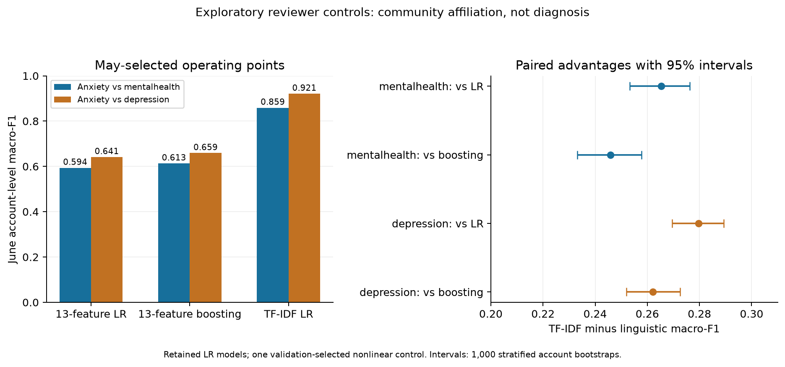
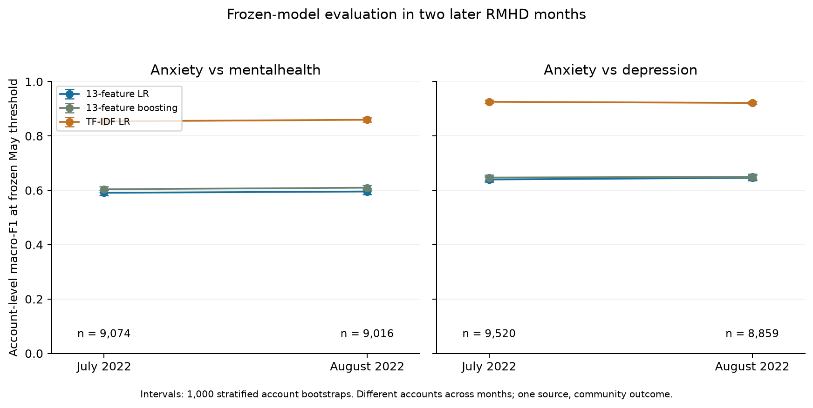

# Linguistic and lexical models for anxiety-community language: a temporal robustness study in RMHD

Research manuscript draft, 7 October 2026. Completed exploratory experiments on checksum-verified RMHD version 1, including frozen July/August evaluation and training-account resampling. The author reports that an ethics determination exists and withholds its details here; the authors will complete the required ethics information privately in their submission copy. Human author, affiliation, contribution, funding/conflict and disclosure statements also require completion. This replacement study does not claim reproduction of arXiv:2601.11758v1.

## Abstract

Community-derived mental-health labels can conflate writing context with psychological constructs. We compare 13 sentiment, pronoun and style features with lexical content for anxiety-community classification in Reddit Mental Health Dataset version 1. Observed-account models train in March 2022, tune in May and evaluate unseen accounts in June; frozen models then evaluate July and August under a protocol fixed before those outcomes were inspected. June Anxiety–mentalhealth and Anxiety–depression comparisons contain 8,717 and 9,622 accounts. At threshold 0.5, linguistic logistic regression achieves macro-F1 0.533 and 0.577, versus 0.858 and 0.917 for TF-IDF. May-selected thresholds improve linguistic macro-F1 to 0.594 and 0.641; paired lexical advantages remain 0.265 [95% account-bootstrap interval 0.253–0.276] and 0.280 [0.270–0.289]. Nonlinear linguistic models reach 0.613 and 0.659. Cross-comparator application reduces both representations' discrimination on identical target cohorts. Balanced length/activity restrictions retain lexical advantages, while finite disorder/community-term perturbations reduce lexical scores. Four later-period cohorts contain 8,859–9,520 accounts each; frozen-model lexical advantages remain 0.263–0.286 and persist after excluding accounts observed in earlier parseable archive records. Twenty stratified training-account resamples per comparison retain positive lexical advantages in every run. Linguistic features carry useful community signal, but operating points, one nonlinear control, measured activity differences and substantial verbatim reuse do not explain their predictive deficit. These exploratory findings support short-term persistence within one collection, not clinical anxiety measurement or external generalization. Code, protocols, source hashes and aggregate evidence are released without redistributing individual sensitive material.

## 1. Introduction

Social-media text can provide observations of mental-health discussion at scale, but label validity constrains the conclusions available from predictive experiments. Dataset access, uncertain labels and sampling heterogeneity limit the field [2,3]. Psychological measurement requires distinguishing diagnosed disorders, self-reported symptoms, scale scores and behavioral proxies [5]. An author posting in an anxiety-related forum is participating in a particular social context; this alone does not establish an anxiety disorder, and posting elsewhere does not establish its absence.

Low-dimensional sentiment and pronoun features are inexpensive and readily inspected. Their interpretation is nevertheless ambiguous: they may reflect autobiographical genre, topic or help-seeking conventions shared across mental-health communities. Shen and Rudzicz [9] already compared lexicon, n-gram, topic and embedding representations for anxiety-related Reddit posts; anxiety/panic comparisons also combine lexical and emotion analysis [4]. Ireland and Iserman [8] compared anxiety-forum members' language within and outside support contexts, with held-out users. Pirina and Çöltekin [10] demonstrated dependence on training/control corpora and evaluated different source models on a common target test set. Multi-dataset depression research evaluates lexical and lexicon representations under temporal and domain shift [7], while recent work audits lexical/style channels and proxy-label effects [13]. Related user-level depression work compares temporal semantic and symptom/activity features, with dataset-dependent usefulness [15]. Neither interpretable features, transfer failure nor anxiety-community classification is novel by itself. The relevant question here is how a specific small representation behaves against lexical content when comparison communities discuss other mental-health concerns and evaluation moves to unseen accounts in later months.

This exploratory study asks whether a fixed 13-feature representation distinguishes anxiety-community affiliation beyond simple length/pronoun baselines, how it compares with lexical content, and whether these results persist under length/activity restrictions, keyword perturbations, frozen later-period evaluation and training-account resampling. It is an empirical replication and extension of established context and validity concerns in a specific release, not a new classification method. Its contribution is the measured representation gap and its stability in audited RMHD account cohorts, with adjacent-community comparisons, identical-target transfer, operating-point and representation checks. We study two related contrasts without treating general-interest posts as healthy-person controls. We do not infer diagnosis, clinical screening utility, psychological mechanism or pre-onset risk.

## 2. Data and cohort construction

We use the raw Part A exports from Reddit Mental Health Dataset (RMHD) version 1, released with Rani et al. [1]. The source article describes a January 2019–August 2022 collection and 1,494,019 posts after English-language cleaning. Its 800-post annotated Part B concerns four proposed root-cause categories and supplies no anxiety diagnoses. Kaggle identifies version 1 as dataset ID 3687885, modified 1 September 2023, with publisher-stated CC0. The complete 647,220,389-byte archive was obtained on 7 October 2026; all 225 files were hashed and matched its public listing. All 15 authored CSVs initially supplied for this study are byte-identical to their upstream counterparts. Archive and per-file SHA-256 values are released in the source manifest.

The archive contains 220 raw paths: 219 parseable CSVs and one unsupported Apple Numbers file, `depmay21.numbers`. Two byte-identical CSV pairs are counted once, leaving 1,834,871 parsed rows and 1,813,026 metadata-valid rows under our policy. These are raw export rows before post-level deduplication; they are not the source article's cleaned unique-post count. Actual community cells determine labels, regardless of filenames. Authored exports cover Anxiety, mentalhealth, depression, lonely and SuicideWatch; the first three enter the two contrasts. General-interest examples without observed account identifiers are ineligible for account-level experiments.

We skip byte-identical files and quarantine noncanonical community cells, placeholder/invalid author identifiers and invalid numeric metadata. Reddit author identifiers are case-normalized. These are observed accounts, not verified independent people. The exports contain no original platform post IDs. We use numeric Unix timestamps in UTC because the timezone-free string field differs systematically from UTC and has no documented timezone. Observed coverage is not assumed complete merely because filenames name a month.

Retained posts require nonremoved bodies containing at least ten words after deterministic URL/markdown/unicode/whitespace cleaning. Cleaned titles and bodies are combined. Exact duplicate records are removed. Within a model window, normalized text shared by multiple accounts is quarantined and repeated text within an account is reduced to its earliest occurrence. Later windows remove text already retained in earlier model windows. Training construction does not use future community labels or future text to discard training records. A subsequent audit tests substantial verbatim reuse using an exact five-word-shingle similarity definition; semantic paraphrases remain a limitation.

For each binary comparison, an author observed in both selected communities within the assigned month is excluded using metadata-valid records before body filtering. Positive labels denote exclusive observed Anxiety affiliation in that month; negative labels denote the selected comparison community. This restriction removes ambiguous membership from the chosen estimand and selects an atypical subset of forum participants. It does not assign a psychiatric state.

March 2022 supplies training data, May supplies validation and June supplies the initial test data. Validation and June test accounts cannot occur in either selected community in supplied earlier records, including text-quality-excluded records and boundary-day records outside the three model windows. This initial selection policy is retained unchanged after obtaining the full archive; unknown earlier activity is separately addressed in the later-period sensitivity analysis.

Tables use MH for the Anxiety–mentalhealth contrast and DEP for Anxiety–depression.

| Contrast | Train authors/posts | Validation authors/posts | Test authors/posts | Positive test authors |
|---|---:|---:|---:|---:|
| MH | 11,528 / 14,196 | 10,267 / 12,095 | 8,717 / 9,991 | 3,704 |
| DEP | 13,049 / 15,967 | 11,473 / 13,504 | 9,622 / 11,058 | 3,631 |

No observed account or exact normalized text crosses these model splits. The contrasts share some Anxiety accounts; they are dependent analyses rather than independent replications. Detailed exclusion counts are recorded in the aggregate manifest.

July and August 2022 form two additional retrospective evaluation windows. Their protocol was fixed after June findings were inspected and before July/August model outcomes were evaluated; this is not study preregistration or prospective clinical collection. The same cleaning and monthly affiliation policies apply. Later accounts exclude earlier metadata-valid selected-community activity in the initially supplied March/May/June records, including quality-excluded records, and August additionally excludes July activity. Any account with retained text exactly matching source training/validation text is removed entirely. Earlier retained extension text is excluded from later windows. A stricter sensitivity subset excludes accounts observed in any earlier parseable selected-community raw CSV from 2019 onward. This identifies absence from observed records, not new platform users or verified lifetime absence; the unsupported Numbers file and activity outside this collection remain unobserved.

## 3. Models and evaluation

The 13 linguistic features are VADER negative/neutral/positive/compound scores, TextBlob polarity/subjectivity, first-person singular pronoun rate/count, character count, word count, average word length, punctuation density and emoji count. These tools use English-oriented lexicons; language suitability has not been independently established for every retained post. Features are computed per post and averaged within account. TF-IDF uses concatenated cleaned account text, unigram/bigram features, minimum document frequency two and a maximum vocabulary of 50,000 features.

We compare six baselines: a majority classifier; logistic regression using three length features; two pronoun features; seven features excluding sentiment; all 13 features; and TF-IDF logistic regression. Numeric features use training-fitted standardization. Logistic regressions use the scikit-learn default L2 regularization and solver, no class weighting, max_iter=2000 and seed 42. Scaling and vocabulary fitting use training accounts only. C is selected from {0.1, 1, 10} by May macro-F1 at threshold 0.5, with ties favoring smaller C. Models are retained without refitting on May. The initial decision threshold is 0.5; no test outcome selects hyperparameters, calibration or threshold. Learned probabilities are not clinical risks. Exact software versions and retained model parameters accompany the aggregate results.

The primary metric is macro-F1. We also retain positive-class F1, precision/recall, accuracy, ROC-AUC, average precision, Brier score, log loss and confusion matrices. Paired contrasts use the same ordered test accounts. We compute 1,000 stratified account bootstrap replicates and percentile intervals conditional on the fitted models, observed splits and class counts. These intervals do not quantify uncertain psychiatric labels or sampling/population validity. Exact McNemar comparisons address differences in binary correctness. Additional contrasts are exploratory and unadjusted for multiplicity.

Two secondary checks were fixed before primary test metrics were inspected. First, a balanced June subset matches fixed bins of mean cleaned post length (0–49, 50–99, 100–149, 150–249, 250–499, 500–999, 1000+ words) and activity (1, 2, 3+ posts), retaining the smaller class count in each stratum. SHA-256 ordering based on account identifier and seed selects accounts without using predictions. Continuous residual imbalance is reported. The models and thresholds remain frozen, so this evaluates a changed target population at 50% prevalence.

Second, the frozen TF-IDF model evaluates June text after neutral-token replacement of 22 prespecified disorder/community terms. Topic restrictions and selective masking have established precedents [11,14]; our finite-list frozen-inference perturbation is a sensitivity check, not a new masking method. It does not remove all topical language or retrain the model. A separate 13-feature sensitivity uses the original 16-term list. Different masks prevent interpreting their score changes as identical interventions.

Additional checks were designed after primary June outcomes were inspected and are explicitly post hoc. Retained-model inference first reproduces saved primary probabilities to absolute tolerance 1e-12. Each retained LR model selects a threshold by May macro-F1 on {0.05, 0.06, ..., 0.95}, with ties favoring proximity to 0.5 and then the smaller threshold. C, preprocessing and weights remain unchanged.

To test a linear-model explanation, histogram gradient boosting uses the same 13 feature means, max_iter=200, l2_regularization=1, early_stopping=False and seed=42. Four max-leaf/learning-rate configurations ({15,31} × {0.05,0.1}) are selected by May macro-F1 at 0.5, followed by the same May threshold selection. Nothing is fit or selected using June labels.

Cross-comparator application evaluates the other comparison's retained LR models on the same target June cohort as native models. Accounts seen in source training/validation and accounts with exact source-training/validation text are excluded. Source models keep their source-May thresholds. This changes training cohorts and hyperparameters alongside the comparison community, and cannot isolate a causal effect of the negative community alone. Five-word-shingle set Jaccard >=0.8 is audited between each test window and March/May using lossless prefix candidate filtering and exact set verification. Accounts with detected reuse are excluded in a sensitivity check; this definition does not cover arbitrary paraphrases.

For July/August, linguistic LR, TF-IDF LR and histogram boosting retain their original March weights, preprocessing and May thresholds. No parameters, vocabulary, calibration or operating points are learned from these new windows. Each comparison/month receives the same 1,000 paired stratified-account bootstrap procedure, separately for the main cohort, historical-absence subset and reuse-exclusion subset. Score changes across months concern distinct selected accounts and changing prevalence; they do not isolate a causal effect of time.

Training-sample sensitivity uses 20 stratified March-account bootstrap resamples per comparison, seeds 100–119. Each resample preserves the original class counts, retains the primary LR C, refits numeric scaling or TF-IDF vocabulary and LR weights, and chooses its threshold on the original May cohort. June evaluates every run, without selecting a best seed or replacing primary models. Means, sample standard deviations and ranges describe these 20 runs; they are not population confidence intervals or estimates of uncertain psychiatric labels.

## 4. Results

| Model | MH macro-F1 [95% interval] | DEP macro-F1 [95% interval] |
|---|---:|---:|
| Majority | 0.365 [0.365, 0.365] | 0.384 [0.384, 0.384] |
| Length only | 0.466 [0.456, 0.476] | 0.493 [0.483, 0.503] |
| Pronouns only | 0.447 [0.439, 0.456] | 0.466 [0.458, 0.475] |
| Without sentiment | 0.480 [0.470, 0.490] | 0.521 [0.511, 0.531] |
| All 13 features | 0.533 [0.523, 0.544] | 0.577 [0.567, 0.588] |
| TF-IDF | 0.858 [0.850, 0.866] | 0.917 [0.911, 0.922] |

The 13-feature model outperforms the simpler linguistic baselines but trails TF-IDF by 0.324 [0.312, 0.336] and 0.340 [0.328, 0.351] macro-F1. Its ROC-AUC is 0.631 and 0.701, versus 0.931 and 0.973 for TF-IDF. Positive F1 is 0.356 and 0.393, versus 0.831 and 0.894. Majority bootstrap intervals collapse because stratification fixes the class counts and the classifier predicts a constant class.

The restricted subsets retain 7,248 and 7,260 accounts. Mean-length standardized differences decrease from -0.320 to -0.019 and -0.167 to -0.014; activity differences decrease from 0.094 to 0.024 and 0.069 to 0.013. On these subsets, 13-feature macro-F1 is 0.497 [0.486, 0.508] and 0.546 [0.535, 0.557]; TF-IDF is 0.848 [0.840, 0.857] and 0.909 [0.902, 0.916]. This persistent lexical advantage is not explained solely by the coarse measured length/activity differences. The subset design does not isolate a causal effect of removing these covariates.

Frozen TF-IDF keyword replacement reduces macro-F1 to 0.698 and 0.807, paired differences -0.159 [-0.169, -0.151] and -0.110 [-0.117, -0.103]. Remaining discrimination may still depend on unmasked topic or community-language cues. Under its different original keyword mask, the 13-feature model reaches 0.482 and 0.590, showing that perturbation effects depend on the comparison context.

The post-hoc validation-selected thresholds are 0.44/0.37 for linguistic LR and 0.42/0.37 for TF-IDF. The resulting June macro-F1 values are 0.594/0.641 and 0.859/0.921. Paired lexical advantages remain 0.265 [0.253, 0.276] and 0.280 [0.270, 0.289]. The linguistic positive recall increases from 0.260/0.293 to 0.532/0.642. Thus a fixed 0.5 threshold understates the representation's signal, but does not explain the ranking.

Gradient boosting selects 15 leaves and learning rate 0.1 in both comparisons. Its macro-F1 is 0.594/0.634 at 0.5 and 0.613/0.659 at May-selected thresholds 0.45/0.42. Improvements over threshold-selected linguistic LR are 0.019 [0.008, 0.030] and 0.018 [0.009, 0.026]. TF-IDF still exceeds nonlinear linguistic features by 0.246 [0.233, 0.258] and 0.262 [0.252, 0.273]. This tests one nonlinear control, not all attainable performance with these features.

| Target June comparison (source for transfer) | Eligible accounts | Linguistic native → transferred macro-F1 | TF-IDF native → transferred macro-F1 |
|---|---:|---:|---:|
| MH (DEP) | 8,551 | 0.593 → 0.549 | 0.860 → 0.801 |
| DEP (MH) | 9,497 | 0.641 → 0.580 | 0.921 → 0.878 |

Figure 1. May-selected operating-point performance and paired lexical advantages; intervals condition on the fitted models and observed class counts.

Transfer excludes 166/125 source-exposed accounts. Paired transferred-minus-native macro-F1 differences are -0.044 [-0.056, -0.031] and -0.061 [-0.073, -0.050] for linguistic LR, and -0.058 [-0.067, -0.050] and -0.043 [-0.049, -0.036] for TF-IDF. Linguistic ROC-AUC declines from 0.630 to 0.574 and 0.701 to 0.615; lexical ROC-AUC declines from 0.931 to 0.905 and 0.973 to 0.948. This is within-collection comparator transfer, not external clinical validation. The two model families do not have a uniformly ordered transfer penalty.

The reuse audit identifies one/two June posts belonging to one/two accounts. Removing these accounts changes fixed-threshold primary macro-F1 by less than 0.0002 for either model. Substantial verbatim reuse under this definition therefore does not explain the primary score gap.

Only 205 and 234 June accounts have at least three eligible posts; most have one. The available cohort does not support an informative early-history experiment, and no onset outcome is supplied.

### 4.1. Frozen later-period evaluation

| Contrast | Month | Accounts / posts | Linguistic LR macro-F1 | Linguistic boosting | TF-IDF LR | Paired TF-IDF minus linguistic LR [95% interval] |
|---|---|---:|---:|---:|---:|---:|
| MH | July | 9,074 / 10,400 | 0.591 | 0.604 | 0.854 | 0.263 [0.251, 0.275] |
| MH | August | 9,016 / 10,157 | 0.596 | 0.610 | 0.860 | 0.264 [0.252, 0.275] |
| DEP | July | 9,520 / 10,961 | 0.640 | 0.647 | 0.926 | 0.286 [0.276, 0.296] |
| DEP | August | 8,859 / 9,968 | 0.646 | 0.650 | 0.922 | 0.275 [0.264, 0.286] |

The four cohorts contain 3,764, 3,653, 3,674 and 3,571 positive accounts, respectively. There is no account overlap across evaluation months within a comparison. Anxiety accounts can recur across comparisons, so these counts must not be summed as unique people. All weights and thresholds are frozen. Lexical advantages over boosting are 0.250 [0.239, 0.262], 0.250 [0.239, 0.263], 0.279 [0.268, 0.289] and 0.272 [0.260, 0.283], in table order. Full metric intervals, confusion matrices, fixed-0.5 results and source/artifact hashes are released.

Figure 2. July/August macro-F1 at unchanged May-selected thresholds, with 1,000 stratified-account bootstrap intervals. Accounts differ across months; all observations come from one source collection.

| Contrast / month | Historical-absence accounts | Linguistic LR | Boosting | TF-IDF | Paired lexical advantage [95% interval] |
|---|---:|---:|---:|---:|---:|
| MH / July | 7,629 | 0.588 | 0.603 | 0.857 | 0.269 [0.256, 0.281] |
| MH / August | 7,805 | 0.597 | 0.613 | 0.862 | 0.265 [0.252, 0.278] |
| DEP / July | 7,786 | 0.640 | 0.648 | 0.928 | 0.288 [0.277, 0.300] |
| DEP / August | 7,450 | 0.645 | 0.650 | 0.924 | 0.279 [0.267, 0.291] |

The stricter subset retains the representation ranking after accounting for earlier observed selected-community activity. It changes the target population and does not establish complete prior inactivity. The substantial-reuse audit detects no affected accounts in three later cohorts and one account in the Anxiety–depression August cohort; the corresponding exclusion sensitivity is retained in the aggregate release.

### 4.2. Training-account resampling

| Contrast | Linguistic LR mean ± SD | TF-IDF mean ± SD | Lexical advantage mean ± SD | Advantage minimum–maximum |
|---|---:|---:|---:|---:|
| MH | 0.593 ± 0.003 | 0.854 ± 0.002 | 0.262 ± 0.003 | 0.254–0.267 |
| DEP | 0.639 ± 0.002 | 0.917 ± 0.001 | 0.278 ± 0.002 | 0.274–0.281 |

Lexical advantages are positive in all 40 resampled-training runs and large relative to this training-sample variation. These descriptive distributions condition on the original March cohort and fixed May/June evaluations. They do not quantify collection or label uncertainty. Complete seed-specific results are released, avoiding selection of a favorable run.

## 5. Discussion

The small linguistic representation contains useful community-associated information, with stronger results under validation-selected thresholds and a nonlinear model. Lexical content remains substantially more useful for this particular outcome. This advantage persists in two later months, a stricter observed-history subset and all training-account resamples. The transfer results demonstrate dependence on the fitted comparison; the study does not prove that lexical models always transfer worse than linguistic models. The findings qualify strong interpretations of sentiment/pronoun/style signals as anxiety-specific markers: these measures have limited ability to distinguish nearby mental-health discussion contexts in the evaluated collection. Their coefficients do not establish psychological mechanism, and correlated/compositional sentiment variables prevent simple coefficient-magnitude rankings from establishing dominance.

High TF-IDF performance is consistent with separable community-language distributions; it supplies no clinical evidence. The keyword perturbation shows reliance on a finite set of disorder/community terms, while residual performance leaves broader topical dependence unresolved. Ireland and Iserman [8] already demonstrated a substantial distinction between predicting anxiety-discussion context and distinguishing forum members in neutral contexts. Their different data, features and outcomes preclude direct score comparisons. Our results extend this context-sensitive interpretation to nearby mental-health comparison communities with an explicit frozen temporal evaluation. They are compatible with measurement-validity concerns [5] and prior selection, longitudinal and domain-shift findings [3,6,7]; they do not establish causal mechanisms or diagnose participants.

The interpretation also has close precedents in common-target corpus comparisons [10] and topic-dependent sentiment/linguistic analysis [12]. Hassan [13] compares lexical, structural and 154-feature style channels under different stress-label sources, with masking and domain checks; a richer style representation can show different rankings from the 13 features used here. Consequently, our lexical advantage is specific to this representation, outcome and cohort policy. The added evidence is its size and short-term persistence in one source, not a general superiority of lexical models, a first demonstration of proxy-label bias, or validation of a new diagnostic marker.

The chief limitations are sampling coverage, exclusive-affiliation selection, unknown activity outside the collected communities, account rather than person independence, potential bots/multiple accounts, unverified language suitability, absent original post IDs, unresolved semantic paraphrases and dependent comparisons from one source. Release identity is verified, but the raw export count is not a verified unique-post count and one Numbers file is outside parsed historical coverage. English-oriented feature tools are not independent language verification. Initial June analyses include explicitly post-hoc checks; the later-period protocol was fixed before inspecting those outcomes but after learning from June, without preregistration. Fixed-model bootstrap intervals omit training and label uncertainty. Training resampling probes one component of fitting variability while leaving label validity, source collection and model-selection uncertainty unresolved. Coarse matching changes prevalence and population, and keyword replacement can introduce distribution shift. The short time separation and one-source design do not establish external generalization.

An additional authorized collection/source or compatible observed-user dataset would strengthen generalization claims, with an untouched holdout for a newly fixed design. It is not needed to define this bounded case study, but broad claims about anxiety-language mechanisms or deployment are unsupported. SMHD provides a relevant self-reported-diagnosis/matched-control design [2], subject to current access and use conditions; self-report still differs from clinician assessment. A clinical anxiety study would require a validated anxiety outcome and a separate appropriate design. Our incremental contribution is an inspectable robustness case, not a new classifier family or the first demonstration of context dependence.

## 6. Ethics, availability and research status

The source study reports Victoria University Human Research Ethics Committee approval HRE23-005, dated 29 May 2023 [1]. This approval belongs to the original study and is not assigned to the present secondary analysis. The present author reports that an institutional determination exists and that its details cannot be shared in this chat. The documents have not been independently reviewed in preparing this draft. The authors will insert the reviewing body, actual decision, reference if issued, date and applicable scope privately into their submission copy, following the target journal's reporting requirements. This status statement is not the final journal ethics declaration. No current-project approval number, exemption or consent basis is inferred. The publisher states CC0 for RMHD version 1, which establishes the stated source license without establishing the secondary study's institutional determination.

Raw post texts, observed usernames, individual predictions and fitted vocabularies remain outside the Git checkout in access-restricted local directories. Code, pinned dependencies, aggregate results, figures, protocols and source/artifact hashes are available at [the research repository](https://github.com/iUtsa/Early-linguistic-pattern-social-socialAnxiety-post-NLP). The source collection is available through its [Kaggle version-1 record](https://www.kaggle.com/datasets/entenam/reddit-mental-health-dataset). Reproduction requires obtaining those inputs under their applicable terms and following the recorded cohort rules; individual sensitive material is not redistributed here. All 15 initially supplied authored files were verified against the complete upstream archive. Institution-specific storage/retention arrangements, authorship, affiliations, contributions, funding/conflicts and substantial AI-assistance disclosures require factual human completion and review.

These results are exploratory. No synthetic control histories are treated as people, and no diagnosis/onset conclusion is supported. The paper offers a modest applied robustness contribution positioned against established context/proxy/domain-validity work. Independent data would strengthen the study; documented institutional and human-author declarations remain submission requirements.

## References

1. Rani S, Ahmed K, Subramani S. From Posts to Knowledge: Annotating a Pandemic-Era Reddit Dataset to Navigate Mental Health Narratives. *Applied Sciences*. 2024;14(4):1547. [doi:10.3390/app14041547](https://doi.org/10.3390/app14041547).
2. Cohan A, Desmet B, Yates A, Soldaini L, MacAvaney S, Goharian N. SMHD: A Large-Scale Resource for Exploring Online Language Usage for Multiple Mental Health Conditions. COLING 2018. [ACL C18-1126](https://aclanthology.org/C18-1126/).
3. Harrigian K, Aguirre C, Dredze M. On the State of Social Media Data for Mental Health Research. CLPsych 2021. [ACL 2021.clpsych-1.2](https://aclanthology.org/2021.clpsych-1.2/).
4. Mitrović S, Lithgow-Serrano OW, Schillaci C. Comparing panic and anxiety on a dataset collected from social media. CLPsych 2024. [ACL 2024.clpsych-1.12](https://aclanthology.org/2024.clpsych-1.12/).
5. Shani C, Stade EC. Measuring Mental Health Variables in Computational Research: Toward Validated, Dimensional, and Transdiagnostic Approaches. CLPsych 2025. [ACL 2025.clpsych-1.6](https://aclanthology.org/2025.clpsych-1.6/).
6. Harrigian K, Dredze M. Then and Now: Quantifying the Longitudinal Validity of Self-Disclosed Depression Diagnoses. CLPsych 2022. [ACL 2022.clpsych-1.6](https://aclanthology.org/2022.clpsych-1.6/).
7. Harrigian K, Aguirre C, Dredze M. Do Models of Mental Health Based on Social Media Data Generalize? *Findings of EMNLP*. 2020;3774–3788. [ACL 2020.findings-emnlp.337](https://aclanthology.org/2020.findings-emnlp.337/).
8. Ireland ME, Iserman M. Within and Between-Person Differences in Language Used Across Anxiety Support and Neutral Reddit Communities. *CLPsych*. 2018;182–193. [ACL W18-0620](https://aclanthology.org/W18-0620/).
9. Shen JH, Rudzicz F. Detecting Anxiety through Reddit. *CLPsych*. 2017;58–65. [ACL W17-3107](https://aclanthology.org/W17-3107/).
10. Pirina I, Çöltekin Ç. Identifying Depression on Reddit: The Effect of Training Data. *SMM4H*. 2018;9–12. [ACL W18-5903](https://aclanthology.org/W18-5903/).
11. Pananookooln C, Akaranee J, Silpasuwanchai C. Comparing Selective Masking Methods for Depression Detection in Social Media. *Computational Linguistics*. 2023;49(3):525–553. [ACL 2023.cl-3.1](https://aclanthology.org/2023.cl-3.1/).
12. Sharma N, Sirts K. Context is Important in Depressive Language: A Study of the Interaction Between the Sentiments and Linguistic Markers in Reddit Discussions. *WASSA*. 2024;344–361. [ACL 2024.wassa-1.28](https://aclanthology.org/2024.wassa-1.28/).
13. Hassan MY. The Divergence Hypothesis: Unmasking Lexical Interference and Label Bias in Mental Health NLP. *BioNLP*. 2026;1–14. [ACL 2026.bionlp-1.1](https://aclanthology.org/2026.bionlp-1.1/).
14. Wolohan JT, Hiraga M, Mukherjee A, Sayyed ZA, Millard M. Detecting Linguistic Traces of Depression in Topic-Restricted Text: Attending to Self-Stigmatized Depression with NLP. *Language Cognition and Computational Models*. 2018;11–21. [ACL W18-4102](https://aclanthology.org/W18-4102/).
15. Farruque N, Goebel R, Sivapalan S, Zaïane OR. Deep temporal modelling of clinical depression through social media text. *Natural Language Processing Journal*. 2024. [doi:10.1016/j.nlp.2023.100052](https://doi.org/10.1016/j.nlp.2023.100052). [Author preprint v3](https://arxiv.org/abs/2211.07717v3).
