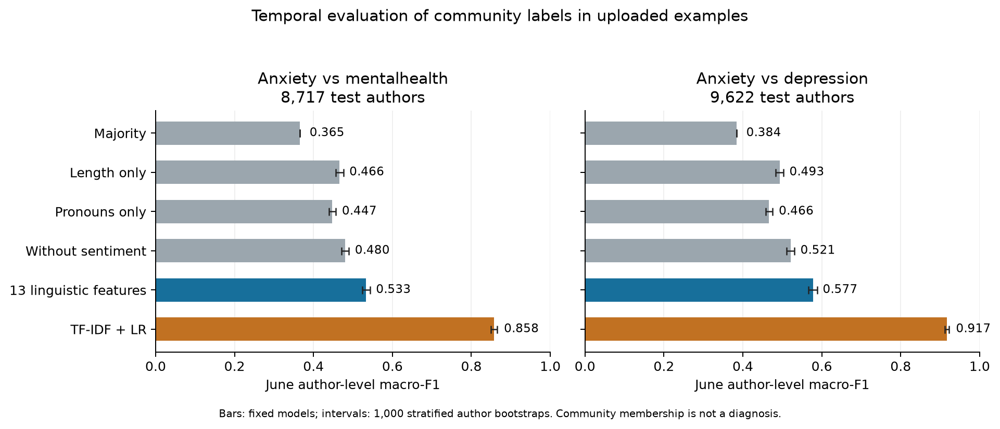

# Findings from the uploaded data and new pilot

7 October 2026. This report updates [the publication review](PUBLICATION_REVIEW.md) after the two upload batches, comprising 47 files including repeated uploads. The conclusion remains: **the current preprint is not ready for Q2, Q3 or Q4 submission.** The uploads made a defensible exploratory community-language analysis possible; they did not restore the clinical or early-detection evidence.

## What the uploads establish

The author identified [Rani, Ahmed and Subramani's dataset study](https://www.mdpi.com/2076-3417/14/4/1547), DOI 10.3390/app14041547, as the main source. Its PDF was retrieved from the publisher's asset host after the runtime reconnected; methods, dataset organization, ethics and availability sections were read. It describes **1,494,019 original posts from January 2019–August 2022** across the same five communities. Raw Part A has the same observed-author/UTC/score/body/community/title/local-time schema as the uploads. Part B comprises 800 manually annotated posts in four proposed root-cause categories, not diagnostic labels. The dataset link has now been resolved to Kaggle RMHD version 1 with a stated CC0 license. All 15 authored names/byte lengths match its listing; this corroborates release correspondence without verifying upstream checksum identity or complete sampling coverage.

The source paper reports Victoria University Human Research Ethics Committee approval **HRE23-005**, dated 29 May 2023, and points to Kaggle through `https://rb.gy/ewtjy`. This is documentation reported for the original study, not automatic approval/exemption for the current secondary project. The source version and stated license are now documented in the data card; the appropriate institutional determination for reuse remains outstanding. Do not adopt the source paper's general claims of unbiased/complete API sampling without auditing the supplied data.

The initial raw CSVs contain 259,190 rows **before duplicate removal**. Fifteen CSVs have observed authors; one is a byte-identical duplicate of another June mental-health file. Loading those authored files once yields 137,255 rows across five communities. There are 118 noncanonical community cells; their contents are quarantined and are not quoted here. The exports lack original Reddit post IDs. CSV row indices and derived text hashes cannot replace those IDs for provenance.

The two large r/datasets comment exports share all 54,848 valid comment IDs. They are not independent datasets and contain no authors. The jobs/employment and whatsbotheringyou exports also lack author identifiers. These sources cannot supply observed-user control histories. General-interest community membership would not establish absence of anxiety even if authors were recoverable.

All fifteen authored files have parseable numeric timestamps, but their timezone-free string timestamps differ from the numeric UTC values by 11 hours in five March files and 10 hours in ten later files. The pilot uses numeric Unix timestamps and actual UTC dates. It does not infer an undocumented string timezone or assume complete calendar coverage from filenames.

The uploaded primary tables and nine figures match the repository byte for byte. Neither upload batch supplies original individual held-out predictions. `final_validation_report.json` contains conclusions and counts, not a reproducible validation program or underlying measurements; it cannot certify the study as sound. The historical results summary concerns a different reported run and is not used as new evidence.

## The clinical label audit changes the interpretation

The additional clinical files contain 107 train, 35 development and 47 test participants, with no participant-ID overlap: 189 distinct participants. The two test manifests contain the same IDs. `labels.csv` combines the 142 train/development participants, and its scores, original depression labels and split assignments agree with those source files. Its observed ID column is `participant_id`; its added `participant_ID` alias is entirely empty.

Every value in `labels.csv`'s **`anxiety_label` equals PHQ-8 score ≥ 10**. This is a label derived from a depression symptom scale, not an anxiety measure. The supplied official depression labels include 30/107 positive train cases, 12/35 positive development cases and 14/47 positive test cases. One score-derived label disagrees with the supplied original binary label; preserve the discrepancy and verify the authoritative version rather than silently overwriting it.

The supplied development cohort has 12 positive/23 negative labels. The preprint's 17/18 grouping of 35 participants is therefore not recoverable from that split as provided. The original paper's 35 participant IDs have not been supplied, so the equal sample size alone does not prove it used this development cohort. Recover the original participant list, threshold and exclusion recipe if that historical analysis is retained.

No clinical transcripts or measured linguistic-feature rows accompany these label tables. Accordingly, the new files do **not** allow recomputation of clinical Hedges' g, clinical feature correlations, sign agreement from measurements, or external language-model predictions. The original generator's three constant effects must remain excluded from empirical claims. [The PHQ-8 source](https://doi.org/10.1016/j.jad.2008.06.026) concerns depression; [GAD-7](https://doi.org/10.1001/archinte.166.10.1092) is a different anxiety instrument. These scale-source citations were checked bibliographically, not as full-text clinical reviews.

## New, attributable experiment

The [primary protocol](UPLOADED_PILOT_PROTOCOL.md) was fixed before fitting. Label 1 is exclusive observed r/Anxiety affiliation in the assigned month; label 0 is r/mentalhealth or r/depression affiliation. Both are community proxies. Authors observed in both selected communities within a month are excluded before body-quality filtering. Later authors must be absent from all supplied earlier records in those communities, including short or removed posts. This defines a selected cohort of observed accounts, not verified independent patients or population controls.

Training uses March 2022, tuning uses May, testing uses June, in UTC. Retain nonremoved bodies with at least ten cleaned words, combine cleaned title/body, and apply exact-record/text deduplication. Six baselines use identical users, training-only scaling/vocabulary and validation-only C selection from 0.1, 1 and 10. The decision threshold stays 0.5. Linguistic features are author means; TF-IDF uses concatenated author text. No model is refitted on validation or test rows.

| Comparison | March training authors/posts | May validation authors/posts | June test authors/posts | June Anxiety prevalence |
|---|---:|---:|---:|---:|
| Anxiety–mentalhealth | 11,528 / 14,196 | 10,267 / 12,095 | 8,717 / 9,991 | 42.49% |
| Anxiety–depression | 13,049 / 15,967 | 11,473 / 13,504 | 9,622 / 11,058 | 37.74% |

There is zero shared observed author or normalized text across model splits. A later near-duplicate audit addresses substantial verbatim reuse; semantic paraphrases, undisclosed multiple accounts and activity outside the uploads remain unresolved. The two comparisons share some Anxiety authors and must not be treated as independent replications.

## Primary results

June **author-level macro-F1**, with 95% percentile intervals from 1,000 stratified author bootstrap replicates:

| Frozen model | Anxiety–mentalhealth | Anxiety–depression |
|---|---:|---:|
| Majority | 0.365 [0.365, 0.365] | 0.384 [0.384, 0.384] |
| Length only | 0.466 [0.456, 0.476] | 0.493 [0.483, 0.503] |
| Pronouns only | 0.447 [0.439, 0.456] | 0.466 [0.458, 0.475] |
| Without sentiment | 0.480 [0.470, 0.490] | 0.521 [0.511, 0.531] |
| All 13 linguistic features | **0.533 [0.523, 0.544]** | **0.577 [0.567, 0.588]** |
| TF-IDF + LR | **0.858 [0.850, 0.866]** | **0.917 [0.911, 0.922]** |

TF-IDF's paired macro-F1 advantage over 13 features is 0.324 [0.312, 0.336] and 0.340 [0.328, 0.351]. The 13-feature ROC-AUC values are 0.631 and 0.701, versus 0.931 and 0.973 for TF-IDF. Its positive-class F1 values are 0.356 and 0.393, versus 0.831 and 0.894 for TF-IDF. Thus the features have some community association, but the claim that a small sentiment/pronoun set adequately captures anxiety-specific language is unsupported here. Macro-F1 0.5 is not automatically a chance benchmark under these class proportions and thresholds; compare the actual baselines.

Intervals condition on the fitted model, observed split and class counts. They do not account for label validity, sampling uncertainty or variation over training datasets. A stratified majority interval collapses because its class counts and constant predictions are fixed. Exact McNemar addresses correctness differences, not F1. Very small exact probabilities underflowed in the original private JSON; the aggregate export stores finite log10 probabilities and marks underflow rather than publishing p = 0. Secondary comparisons are exploratory and not multiplicity-adjusted.

**Do not call these numbers a fall from the paper's 89.34% F1.** The units, cohorts, label comparisons, prevalence, time windows and training recipe differ. This is a new pilot, not reproduction of the primary published experiment.

## Fixed secondary checks

The [secondary protocol](UPLOADED_PILOT_SECONDARY_PROTOCOL.md) was written while the primary jobs ran, before their test metrics were inspected. No primary model was changed.

| Length/activity-restricted June subset | Authors | 13-feature macro-F1 [95% CI] | TF-IDF macro-F1 [95% CI] |
|---|---:|---:|---:|
| Anxiety–mentalhealth | 7,248 | 0.497 [0.486, 0.508] | 0.848 [0.840, 0.857] |
| Anxiety–depression | 7,260 | 0.546 [0.535, 0.557] | 0.909 [0.902, 0.916] |

Fixed word-count/activity strata retain equal class counts, without using predictions to select authors. Mean-word-count standardized differences decrease from -0.320 to -0.019 and -0.167 to -0.014; activity differences decrease from 0.094 to 0.024 and 0.069 to 0.013. These are coarse covariate restrictions, not exact matching or causal adjustment. They change prevalence to 50% and select different test populations, while retaining models trained on the original prevalence and threshold. Absolute score changes therefore cannot be attributed exclusively to removal of length effects.

Replacing a fixed 22-term disorder/community word list in June text under the frozen TF-IDF model decreases macro-F1 from 0.858 to 0.698 (paired difference -0.159 [-0.169, -0.151]) and from 0.917 to 0.807 (-0.110 [-0.117, -0.103]). The finite list does not remove all topic language. The primary 13-feature sensitivity used a different, original 16-term list: macro-F1 changes to 0.482 and 0.590. Do not rank these drops as identical interventions, or claim keyword robustness generalizes across comparisons.

Only 205 and 234 June authors respectively have at least three eligible posts. Approximately nine in ten retained test authors have one post. No prefix experiment was run. Monthly snapshots without diagnostic/event labels cannot establish early clinical detection even for the small multi-post subgroup.

## Updated reviewer checks and source verification

The source is now [Kaggle RMHD version 1](https://www.kaggle.com/datasets/entenam/reddit-mental-health-dataset), publisher-stated CC0. Every supplied authored filename and byte length matches its upstream listing. This corroborates source correspondence without proving checksum identity. See the [data card](DATA_CARD.md).

[Post-hoc checks](REVIEWER_CHECK_PROTOCOL.md) independently reproduce the primary frozen-model probabilities. Validation-selected thresholds raise 13-feature macro-F1 to 0.594/0.641 and TF-IDF to 0.859/0.921; the remaining paired lexical advantages are 0.265 [0.253, 0.276] and 0.280 [0.270, 0.289]. This corrects a potential operating-point explanation and demonstrates that the linguistic features contain useful community signal.

The validation-selected nonlinear 13-feature control reaches 0.613/0.659, versus TF-IDF 0.859/0.921. Paired lexical advantages remain 0.246 [0.233, 0.258] and 0.262 [0.252, 0.273]; see [nonlinear results](nonlinear_check_results.json).

Cross-comparator transfer excludes 166/125 source-exposed target authors and shows lower discrimination on identical target cohorts than native models. The exact five-word-shingle Jaccard >=0.8 audit identifies one/two affected test authors; exclusion changes primary macro-F1 by less than 0.0002. Broader semantic duplication remains unresolved. The [aggregate reviewer report](reviewer_check_results.json) includes complete parameters, metrics, paired intervals and hashes. The [submission decision](SUBMISSION_DECISION.md) states the revised contribution and separates remaining requirements from useful strengthening.

## Researcher and reviewer decision

I would rewrite the project as **community specificity and temporal robustness of interpretable linguistic features**, remove the clinical/early-detection claims, and retain the original preprint/results as historical evidence. I would not tune June outcomes until the 13-feature score resembles the original paper. Its weakness relative to lexical content is part of the new result.

The original review identified the following improvements. The later [submission decision](SUBMISSION_DECISION.md) separates actual reporting/governance requirements from optional strengthening for the narrower replacement; this is not a universal journal checklist:

1. **Resolve provenance and ethics.** Supply the exact dataset URL/version, completeness, collection/use terms, exclusions and appropriate institutional determination. Reconcile the original source date claims with these 2022 examples. Document limitations of observed-account independence and missing original post IDs.
2. **Establish a contribution beyond a routine baseline comparison.** Frame a specific hypothesis about source specificity or contextual dependence, position it against the 2021/2022 data-validity work, 2024 anxiety/panic analysis and 2025 measurement-validity recommendations, and demonstrate what new evidence the design contributes.
3. **Obtain additional evaluation data.** These two contrasts share authors and one supplied source; they are not independent external validation. Use another authorized collection period/source, or a compatible observed-user dataset such as controlled-access SMHD if available. Keep a fresh holdout for the next frozen design; the present June data have now been inspected.
4. **Strengthen confound and robustness analysis.** Resolve near duplicates, language suitability, potential bots, topic/genre and residual activity/length imbalance; test masked retraining under a justified list and report selection effects. Add strong representation baselines only where they help answer the hypothesis. A larger model cannot repair invalid labels.
5. **Rewrite and regenerate attributable tables.** Use the new account-level estimand consistently, measured predictions and cohort flow. Do not retain unverifiable original clinical effects, synthetic control trajectories, raw-coefficient dominance claims or cross-dataset F1 rankings. Clinical participant transcripts/features are needed only if a clearly labelled depression-transfer analysis is retained; they would still not validate anxiety.

For **Q3/Q4**, a completed, well-positioned applied robustness study is a more defensible route than the current clinical/early-detection story, but these pilot tables alone are not sufficient novelty or submission evidence. For **Q2**, I would additionally expect compelling independent replication and a substantive insight about community/context or measurement; a technically correct LR benchmark alone is a weak contribution. The [review's journal table](PUBLICATION_REVIEW.md#journal-choices-with-verified-quartiles) reports SJR 2025 categories, not JCR eligibility or acceptance odds. Quartile choice does not lower the validity requirements.

## Artifacts and verification

The [aggregate result manifest](uploaded_pilot_results.json) contains cohort exclusions, complete metrics, intervals, paired contrasts, matched/masked checks, input/code/package/model hashes and clinical label audit. Individual saved predictions were independently checked against their confusion matrices and macro-F1 arithmetic. All primary/secondary artifact checksums passed. The [new manuscript draft](REVISED_PILOT_MANUSCRIPT.md) includes only the supported pilot scope and results; it remains incomplete for submission.

Private inputs, fitted vocabularies and anonymous individual predictions are outside Git under `/workspace/research-private`. Exact primary-run source was archived there and in the public code-only `research/archive/pilot-primary-code` snapshot, with hashes verified, before the numerical p-value-formatting repair. Raw texts/usernames are not included in the aggregate report or figure. Both empirical runs and both fixed sensitivity runs completed. **All 23 regression tests passed**; clinical-label audit and aggregate prediction verification completed. The public research release is traced in Git history; no journal submission, arXiv revision or remote demo update occurred.
